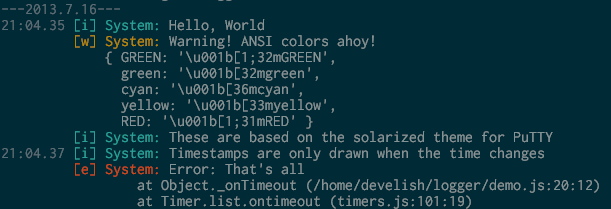

#Logger
A simple logger made for cleaner screen output. No dependencies, requires ANSI support. Works on phantomjs and node.

##Usage

    var Logger = require('logger'),
		log = new Logger(name, level);
	
	log.info('not too bad');

##Levels
There are four levels: silly, info, warn, and error. Each is displayed in a different color with a different prefix. If a log method is called on a log level that is hidden, it will return false, enabling you to chain verbosity like so:

    log.silly('Very verbose message') ||
	log.info('Brief message') ||
	log.warn('Why so ignore?');

##Sample

